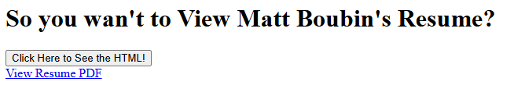

# Django Resume Viewer

A simple Django app that parses a PDF resume and displays it as a web page in HTML.  This app is not deployed and is only intended for users to run locally in the users browser as a development server.

## Features
- Extracts text from a PDF resume
- Splits out Resume sections based on keywords
- Splits job experience into bullet points
- Renders section titles, job titles, and supplemtal information.
- Allows user to toggle between viewing HTML and PDF format

## Setup
After cloning the repository, the user can take the following steps to setup the app.
1. (*OPTIONAL*) Create a virtual environment
    1. Windows
    ```bash
    py -m venv <venv_name>
    <venv_name>/Scripts/activate
    ```
    2. Unix
    ```bash
    python3 -m venv <venv_name>
    source <venv_name>/bin/activat
    ```

2. Install dependencies:
   ```bash
   pip3 install -r requirements.txt
3. Run Server Locally
   ```bash
   python3 manage.py runserver
4. Open navigate to development server in browser
   ```bash
   http://127.0.0.1:8000/
   ```
## Usage
User will enter the app at the home page.  
1. If the *Click Here to see the HTML!* button is selected, user will be sent to HTML page
2. If the *View Resume PDF* hyperlink is selected, the original PDF will display in Browser



